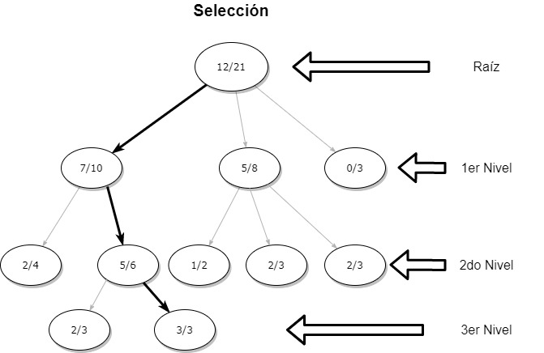
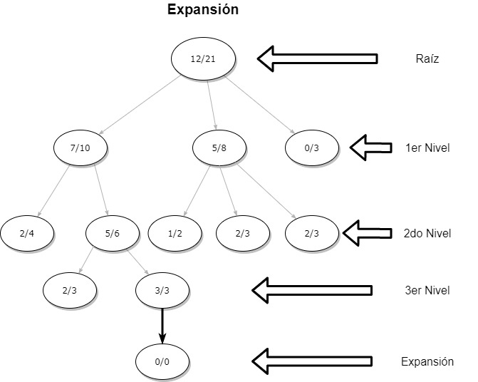
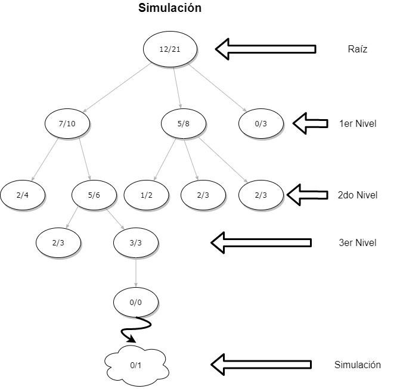
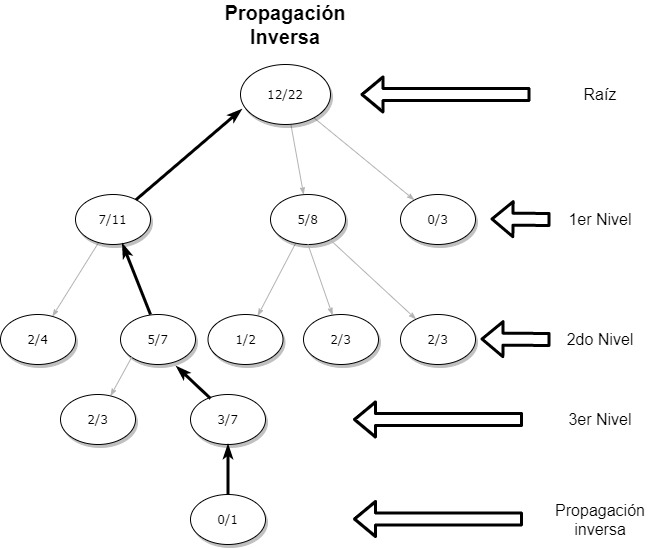

```{r setup, include=FALSE}
knitr::opts_chunk$set(echo = TRUE)
source("montecarlo.R", encoding = "utf-8")
source("ecuaciones.R", encoding = "utf-8")

```


## Búsqueda Montecarlo

Monte Carlo es un metodo númerico muy versatil y facil de implementar, se puede aplicar a problemas de N-dimensiones, en contraste con búsqueda en malla, el método consiste en la elaboración  de N puntos aleatorios usando una distribución de probabilidad sobre el dominio del problema, La complejidad del esfuerzo computacional es $\Phi(N)$.

El árbol de búsqueda de Monte Carlo, es un algoritmo de búsqueda heurístico para algunos tipos de procesos de toma de decisiones sobre todo los que trabajan con juegos. Así como el método de operación el enfoque de búsqueda de Monte Carlo se encuentra en el análisis de los movimientos mas prometedores, ampliando el árbol de búsqueda, basado en un muestreo aleatorio.

### Ventajas
* Se puede aplicar a juegos con un factor de ramificación tan grande que resultan inabordables con las técnicas tradicionales.

* Se puede configurar para que se detenga después de una cantidad de tiempo prefijada, haciendo que con tiempos mayores se obtengan jugadores más fuertes.

* No requiere necesariamente de un conocimiento específico del juego, por lo que puede ser utilizado como motor de juego general; y es adaptable a juegos que incorporan aleatoriedad en las reglas.


\newpage
### Procedimiento

*Selección:* empezar desde la raíz *R* y seleccionar nodos hijos sucesivos hasta alcanzar un nodo hoja *L*. La selección describe una manera de elegir los nodos hijos, que permitan que el árbol se expanda hacia movimientos mas prometedores, que es la esencia del árbol de búsqueda Monte Carlo.

{ width=50% }


*Expansión:* empezar desde la raíz *R* y seleccionar nodos hijos sucesivos hasta alcanzar un nodo hoja *L*. La selección describe una manera de elegir los nodos hijos, que permitan que el árbol se expanda hacia movimientos mas prometedores, que es la esencia del árbol de búsqueda Monte Carlo.

{ width=50% }

\newpage
*Simulación:* realizar una simulación aleatoria desde el nodo C.

{ width=50% }


*Retro Propagación:* utilizar el resultado de la simulación para actualizar la información en los nodos en el camino de *C* a *R*.

{ width=50% }


\newpage
### Codificación

La codificación de Búsqueda Monte Carlo es relativamente sencilla, al hacer uso de el método de búsqueda ciega:

```{r}
mcsearch
```
Su implementación de igual manera es sencilla:

```{r}
N=10000 # se define el número de muestras
#para la función de esfera:
D <- c(2,30,50)
label="esfera"
for(i in 1:length(D))
{ 
  S <- mcsearch(N,rep(-5.2,D[i]),rep(5.2,D[i]),sphere,"min")
  cat(label,"D:",D[i],"s:",S$sol,"f:",S$eval,"\n")
}
label="Rastrigin"
for(i in 1:length(D))
{ S <- mcsearch(N,rep(-5.2,D[i]),rep(5.2,D[i]),rastrigin,"min")
cat(label,"D:",D[i],"s:",S$sol,"f:",S$eval,"\n")
}
```

esfera D: 2 s: -0.01670461 f: 0.0004300608 
esfera D: 30 s: -1.775842 f: 118.7902 
esfera D: 50 s: -1.852643 f: 248.5227 
Rastrigin D: 2 s: 0.9941355 f: 1.159895 
Rastrigin D: 30 s: 3.217168 f: 356.8341 
Rastrigin D: 50 s: 0.9309262 f: 661.3887 
