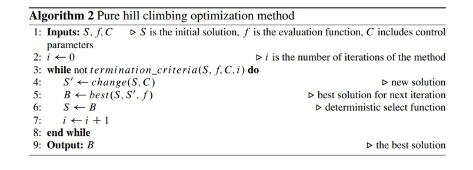

```{r setup, include=FALSE}
knitr::opts_chunk$set(echo = TRUE)
source("hillclimbing.R", encoding = "utf-8")
source("ecuaciones.R", encoding = "utf-8")

```


## Ascenso a la cordillera

El asenso a la colina es un método simple de optimización local que "sube" la colina hasta
se encuentra un óptimo local (asumiendo una meta de maximización). El método funciona
mediante la búsqueda iterativa de nuevas soluciones dentro del entorno de las soluciones, adoptando nuevas soluciones si son mejores, como se muestra en el pseudocódigo
del algoritmo. 
El propósito del cambio de función es producir una solución, realizando una búsqueda completa en todo el vecindario o aplicando un pequeño cambio aleatorio en los valores de la solución actual. Cabe señalar que si bien el el algoritmo estándar de escalada es determinista, cuando se utilizan cambios aleatorios paros perturbando una solución, se logra un comportamiento estocástico. 
Por esta razón en ascenso a la colina es situado en el medio de la dimensión determinista / estocástica.
Hay varias variantes de escalada, como la escalada más empinada


### Ventajas
* Reduce el número de nodos a analizar

### Desventajas

* Puede ser que encuentre una solución, pero no sea la más óptima


### PSEUDOCÓDIGO

*Selección:* empezar desde la raíz *R* y seleccionar nodos hijos sucesivos hasta alcanzar un nodo hoja *L*. La selección describe una manera de elegir los nodos hijos, que permitan que el árbol se expanda hacia movimientos mas prometedores, que es la esencia del árbol de búsqueda Monte Carlo.




\newpage
### Codificación

La codificación de Búsqueda Monte Carlo es relativamente sencilla, al hacer uso de el método de búsqueda ciega:

```{r}
hclimbing
```
Su implementación de igual manera es sencilla:

```{r}
N=10000                              # se define el número de muestras
limI <- -5
limS <- 5
var <- 1					                   # número de variables
upper <- rep (limS,var)		           # vector con el valor mas alto de cada dimensión
lower <- rep (limI,var)		           # vector con el valor mas bajo de cada dimensión
x <- 1                             # punto inicial

fx <- rastrigin
label <- "Rastrigin: "
min <- hclimbing(x,fx,lower,upper,type="min")
max <- hclimbing(x,fx,lower,upper,type="max")

cat(c(label, "Solución mínima: ", min$sol," Evaluación: ", min$eval,"\n"))
cat(c(label, "Solución máxima: ", max$sol," Evaluación: ", max$eval,"\n"))
```
Para la función de esfera seria de la siguiente manera:

```{r}

x <- 3
fx <- sphere
label <- "Esfera: "
min <- hclimbing(x,fx,lower,upper,type="min")
max <- hclimbing(x,fx,lower,upper,type="max")

cat(c(label, "Solución mínima: ", min$sol," Evaluación: ", min$eval,"\n"))
cat(c(label, "Solución máxima: ", max$sol," Evaluación: ", max$eval,"\n"))
```

